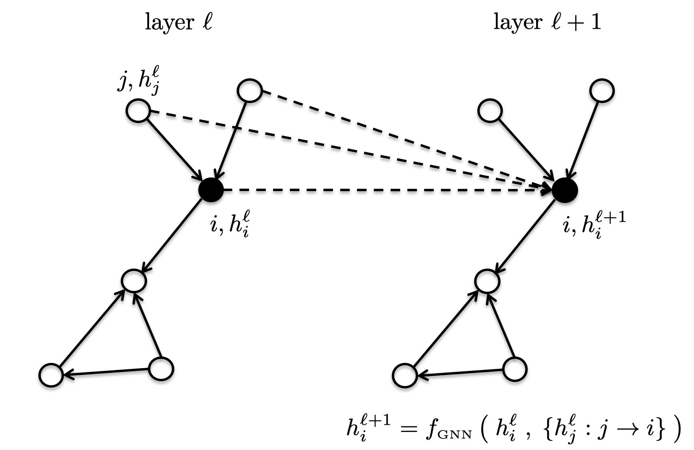

# Benchmarking Graph Neural Networks

<br>

## Updates

**May 10, 2022**
* Project based on DGL 0.6.1 and higher. See the relevant dependencies defined in the environment yml files ([CPU](./environment_cpu.yml), [GPU](./environment_gpu.yml)).  
* Updated technical report of the framework on [ArXiv](https://arxiv.org/pdf/2003.00982.pdf).
* Added [AQSOL dataset](https://www.nature.com/articles/s41597-019-0151-1), which is similar to ZINC for graph regression task, but has a real-world measured chemical target. 
* Added mathematical datasets -- GraphTheoryProp and CYCLES which are useful to test GNNs on specific theoretical graph properties.  
* Fixed [issue #57](https://github.com/graphdeeplearning/benchmarking-gnns/issues/57).  

**Oct 7, 2020**
* Repo updated to DGL 0.5.2 and PyTorch 1.6.0. Please update your environment using yml files ([CPU](./environment_cpu.yml), [GPU](./environment_gpu.yml)).
* Added [ZINC-full](./data/script_download_molecules.sh) dataset (249K molecular graphs) with [scripts](./scripts/ZINC-full/).


**Jun 11, 2020**
* Second release of the project. Major updates : 
	+ Added experimental pipeline for Weisfeiler-Lehman-GNNs operating on dense rank-2 tensors.
	+ Added a leaderboard for all datasets.
	+ Updated PATTERN dataset.
	+ Fixed bug for PATTERN and CLUSTER accuracy.
	+ Moved first release to this [branch](https://github.com/graphdeeplearning/benchmarking-gnns/tree/arXivV1).
* New ArXiv's version of the [paper](https://arxiv.org/pdf/2003.00982.pdf).


**Mar 3, 2020**
* First release of the project.


<br>




## 1. Benchmark installation

[Follow these instructions](./docs/01_benchmark_installation.md) to install the benchmark and setup the environment.


<br>

## 2. Download datasets

[Proceed as follows](./docs/02_download_datasets.md) to download the benchmark datasets.


<br>

## 3. Reproducibility 

[Use this page](./docs/03_run_codes.md) to run the codes and reproduce the published results.


<br>

## 4. Adding a new dataset 

[Instructions](./docs/04_add_dataset.md) to add a dataset to the benchmark.


<br>

## 5. Adding a Message-passing GCN

[Step-by-step directions](./docs/05_add_mpgcn.md) to add a MP-GCN to the benchmark.


<br>

## 6. Adding a Weisfeiler-Lehman GNN

[Step-by-step directions](./docs/06_add_wlgnn.md) to add a WL-GNN to the benchmark.


<br>

## 7. Leaderboards

Full leaderboards coming soon on [paperswithcode.com](https://paperswithcode.com/paper/benchmarking-graph-neural-networks).


<br>

## 8. Reference 

[ArXiv's paper](https://arxiv.org/pdf/2003.00982.pdf)
```
@article{dwivedi2020benchmarkgnns,
  title={Benchmarking Graph Neural Networks},
  author={Dwivedi, Vijay Prakash and Joshi, Chaitanya K and Luu, Anh Tuan and Laurent, Thomas and Bengio, Yoshua and Bresson, Xavier},
  journal={arXiv preprint arXiv:2003.00982},
  year={2020}
}
```


<br><br><br>

